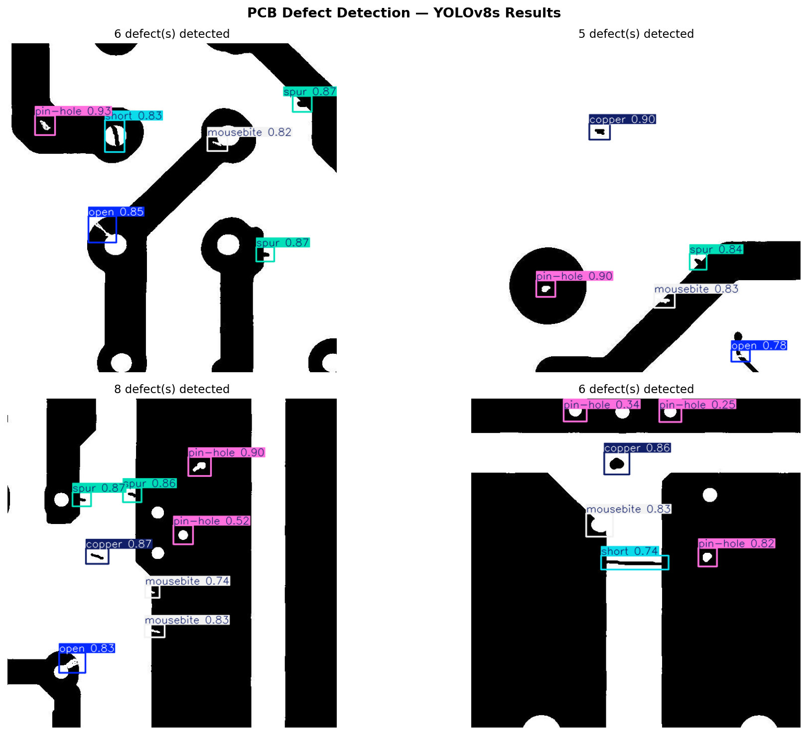

# PCB Defect Detection Using YOLOv8

This project detects six common printed circuit board defects using a YOLOv8s object detection model trained on the DeepPCB dataset.

## Defect Classes

- `open`: missing copper trace or unintended circuit break
- `short`: unintended copper bridge between isolated traces
- `mousebite`: notch removed from a trace edge
- `spur`: excess copper protrusion from a trace
- `copper`: residual copper that should have been etched away
- `pin-hole`: small hole in a copper region

## Repository Contents

| Path | Purpose |
|---|---|
| `app.py` | Streamlit inference demo |
| `best.pt` | Trained YOLOv8s checkpoint used by the app |
| `notebooks/PCB_Defect_Detection_Clean.ipynb` | Training and evaluation notebook |
| `results/pcb_results/` | YOLO training curves, confusion matrices, validation previews, and weights |
| `assets/detection_results.png` | Qualitative detection example |
| `reports/PCB_Defect_Detection_Research_Paper.docx` | Original report copy |
| `reports/PCB_Defect_Detection_Research_Paper_Improved.docx` | Revised report with corrected metrics, tables, figures, and accessibility metadata |
| `artifacts/pcb_results.zip` | Zipped training output artifact |
| `scripts/build_report.py` | Rebuilds the improved DOCX from the included CSV metrics and figures |

## Quick Start

```powershell
python -m venv .venv
.\.venv\Scripts\Activate.ps1
pip install -r requirements.txt
streamlit run app.py
```

The app looks for `best.pt` in the project root by default. You can also upload another YOLO `.pt` file from the sidebar.

## Training Summary

The included run was trained with YOLOv8s at 640 x 640 resolution, batch size 16, and early stopping patience of 10 epochs. The logged training history contains 33 epochs.

| Metric | Best Epoch | Value |
|---|---:|---:|
| Precision | 28 | 0.99226 |
| Recall | 32 | 0.98335 |
| mAP@0.5 | 32 | 0.99376 |
| mAP@0.5:0.95 | 23 | 0.78211 |

Final logged epoch metrics:

| Metric | Value |
|---|---:|
| Precision | 0.98592 |
| Recall | 0.96330 |
| mAP@0.5 | 0.99112 |
| mAP@0.5:0.95 | 0.63227 |

## Example Result



The qualitative sample contains 25 detected defects across four PCB crops. The visible labels include all six classes, with pin-hole, spur, and mousebite appearing most frequently. Low-confidence pin-hole detections near 0.25 to 0.34 should be reviewed manually or filtered with a higher confidence threshold for production use.

## Report

The improved research report is available at `reports/PCB_Defect_Detection_Research_Paper_Improved.docx`. It corrects the training-run metrics to match `results/pcb_results/results.csv`, includes five result figures, and adds Word accessibility metadata for the figures and tables.

To rebuild it:

```powershell
python scripts/build_report.py
```

## Notes

- For CPU-only inference, the app works without CUDA, but inference will be slower.
- For NVIDIA GPU inference, install a CUDA-compatible PyTorch build before installing Ultralytics if needed.
- The model and training artifacts are included directly because each file is below GitHub's 100 MB per-file limit.
